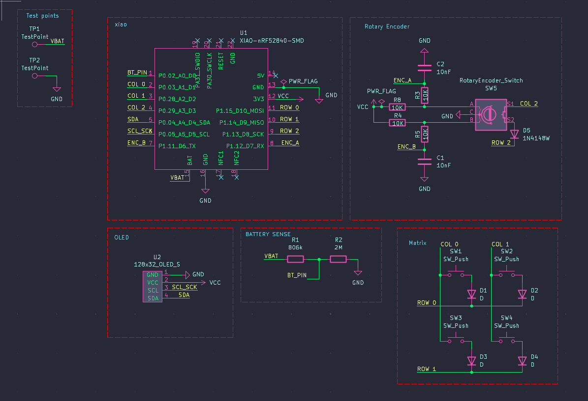
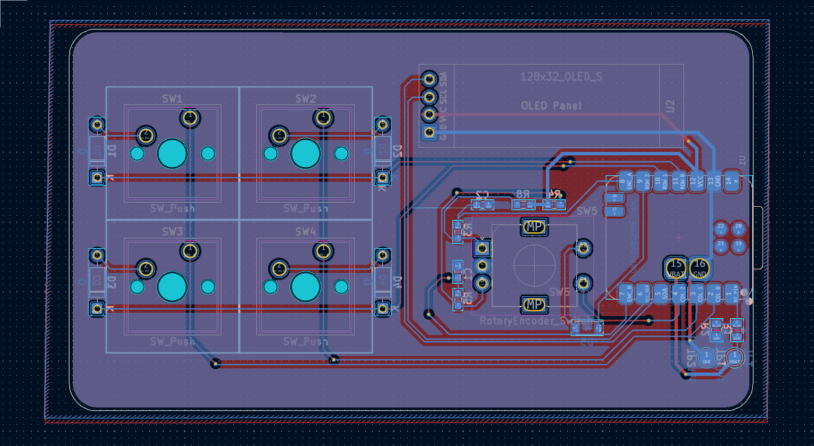

# TrlPad

TrlPad is a 4-key macropad with a rotary encoder, an OLED display.

## Features

- 4 programmable mechanical keys (MX-style switches)
- Rotary encoder with push-button for multi-function input
- 0.91" 128x32 OLED dispvlay (SSD1306)
- Powered by Seeed Studio XIAO nRF52840 (Bluetooth + USB)
- Custom PCB

## How it evolved

### The initial concept
The design concept was to be something akin to a pedal effect. A sketch of what I thought it'd be:

### Final
Yeah, it's rather different but this is more feasible and it's simple yet punk-y.

### PCB
Below is the schematic:

Below is the PCB routing:

---

## Bill of Materials (BOM)

| #  | Reference       | Value                | Footprint                                         | Qty | Link                                                                 | Price (USD) | Running Price (USD) |
|----|----------------|--------------------|--------------------------------------------------|-----|----------------------------------------------------------------------|-------------|-------------------|
| 1  | D1, D2, D3, D4 | D                  | Diode_THT:D_DO-35_SOD27_P7.62mm_Horizontal     | 4   | [AliExpress](https://www.aliexpress.com/item/1005007625866819.html?spm=a2g0o.productlist.main.1.7aeadCCUdCCUEm&aem_p4p_detail=2025102119550212594792942763680001106495&algo_pvid=a434d49d-5a77-4968-bc6d-58301a94e042&pdp_ext_f=%7B%22order%22%3A%2241%22%2C%22eval%22%3A%221%22%2C%22fromPage%22%3A%22search%22%7D&utparam-url=scene%3Asearch%7Cquery_from%3A%7Cx_object_id%3A1005007625866819%7C_p_origin_prod%3A&search_p4p_id=2025102119550212594792942763680001106495_1) | 1.41        | 1.41              |
| 2  | D5             | 1N4148W            | Diode_SMD:D_SOD-123                              | 1   | [AliExpress](https://www.aliexpress.com/item/1005007160279747.html?spm=a2g0o.productlist.main.1.4bea610605GMvi&algo_pvid=69e8bef0-e1cb-4e4b-bf00-d1d1762fa9c0&pdp_ext_f=%7B%22order%22%3A%2254%22%2C%22eval%22%3A%221%22%2C%22fromPage%22%3A%22search%22%7D&utparam-url=scene%3Asearch%7Cquery_from%3A%7Cx_object_id%3A1005007160279747%7C_p_origin_prod%3A#nav-description) | 1.95        | 3.36              |
| 3  | R1             | 806k               | Resistor_SMD:R_0805_2012Metric                  | 1   | [AliExpress](https://www.aliexpress.com/item/1005008964311488.html?spm=a2g0o.productlist.main.1.7afa2680Uz7Hdj&algo_pvid=6147d466-e002-4eeb-800f-490fd843ce71&pdp_ext_f=%7B%22order%22%3A%22-1%22%2C%22eval%22%3A%221%22%2C%22fromPage%22%3A%22search%22%7D&utparam-url=scene%3Asearch%7Cquery_from%3A%7Cx_object_id%3A1005008964311488%7C_p_origin_prod%3A) | 0.66        | 4.50              |
| 4  | R2             | 2M                 | Resistor_SMD:R_0805_2012Metric                  | 1   | [AliExpress](https://www.aliexpress.com/item/1005008964311488.html?spm=a2g0o.productlist.main.1.7afa2680Uz7Hdj&algo_pvid=6147d466-e002-4eeb-800f-490fd843ce71&pdp_ext_f=%7B%22order%22%3A%22-1%22%2C%22eval%22%3A%221%22%2C%22fromPage%22%3A%22search%22%7D&utparam-url=scene%3Asearch%7Cquery_from%3A%7Cx_object_id%3A1005008964311488%7C_p_origin_prod%3A) | 0.48        | 4.50              |
| 5  | SW1, SW2, SW3, SW4 | SW_Push         | Button_Switch_Keyboard:SW_Cherry_MX_1.00u_PCB  | 4   | [AliExpress](https://www.aliexpress.com/item/1005006255961111.html?spm=a2g0o.productlist.main.21.1a957561CIH3R9&algo_pvid=cce3f2b7-a65c-4480-a261-c810498f6d66&pdp_ext_f=%7B%22order%22%3A%22880%22%2C%22eval%22%3A%221%22%2C%22fromPage%22%3A%22search%22%7D&utparam-url=scene%3Asearch%7Cquery_from%3A%7Cx_object_id%3A1005006255961111%7C_p_origin_prod%3A#nav-specification) | 1.01        | 5.51              |
| 6  | SW5             | RotaryEncoder_Switch | Rotary_Encoder:RotaryEncoder_Alps_EC11E-Switch_Vertical_H20mm | 1 | [AliExpress](https://www.aliexpress.com/item/1005006693443387.html?spm=a2g0o.productlist.main.3.3a0754e8XWgMGL&aem_p4p_detail=2025102123460313199915294252100001307677&algo_pvid=41fcd1eb-5860-43c2-b696-f7e4df5bee48&pdp_ext_f=%7B%22order%22%3A%2268%22%2C%22eval%22%3A%221%22%2C%22fromPage%22%3A%22search%22%7D&utparam-url=scene%3Asearch%7Cquery_from%3A%7Cx_object_id%3A1005006693443387%7C_p_origin_prod%3A&search_p4p_id=2025102123460313199915294252100001307677_3) | 0.63        | 6.14              |
| 7  | TP1, TP2        | TestPoint          | TestPoint:TestPoint_Pad_D2.0mm                  | 2   | —                                                                    | —           | 6.14              |
| 8  | U1             | XIAO-nRF52840-SMD  | Modified:modified-XIAO-nRF52840-SMD             | 1   | [AliExpress](https://www.aliexpress.com/item/1005006988954136.html?spm=a2g0o.productlist.main.3.45da24c867QaLR&algo_pvid=7bc7b30e-e03b-4713-8945-3bacfdca3c01&pdp_ext_f=%7B%22order%22%3A%22454%22%2C%22eval%22%3A%221%22%2C%22fromPage%22%3A%22search%22%7D&utparam-url=scene%3Asearch%7Cquery_from%3A%7Cx_object_id%3A1005006988954136%7C_p_origin_prod%3A) | 10.11       | 16.25             |
| 9  | U2             | 128x32_OLED_S      | zzz_Project:SSD1306-0.91-OLED-4pin-128x32       | 1   | [AliExpress](https://www.aliexpress.com/item/1005008640132638.html?spm=a2g0o.productlist.main.2.7a63IqANIqANd9&algo_pvid=2b485676-1627-4ff0-95f6-07098624fd68&pdp_ext_f=%7B%22order%22%3A%221992%22%2C%22eval%22%3A%221%22%2C%22fromPage%22%3A%22search%22%7D&utparam-url=scene%3Asearch%7Cquery_from%3A%7Cx_object_id%3A1005008640132638%7C_p_origin_prod%3A) | 2.24        | 18.49             |
| 10 | Shipping costs  | —                  | for AliExpress check cart.png                    | —   | —                                                                    | 3.05        | 21.54             |
| 11 | 3D Printed case | —                  | check screenshot 3dCase_bill.png                 | —   | [3Ding](https://print.3ding.in/upload)                               | 16.29       | 37.83             |
| 12 | PCB            | —                  | from JLPCB, check screenshot jlcpcb.png          | —   | —                                                                    | 7.56        | 45.39             |

**Total Estimated Cost:** 45.39 USD

####  Note: I am trying to get the case 3D printed using #printing-legion, or if that doesn't work out, I'll cover the cost on my own!
---
